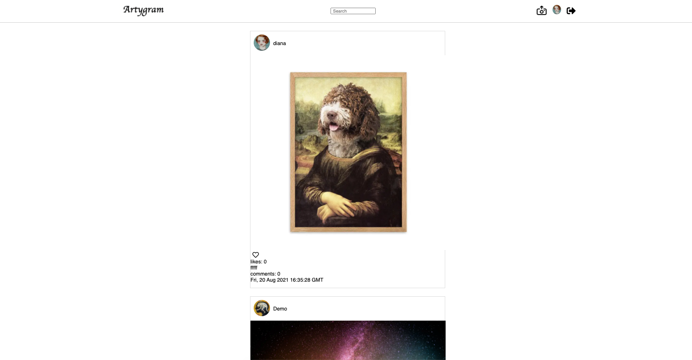

# Artygram

Artygram is an Instrgram clone targeted towards artist. On Artygram you can browse artist's profile pages and view their work 

## Welcome View 

 

## Home View

 

## Technical Details

Artygram's backend is built using Flask and frontend is built using React-Redux 

## Features 

- Signup, Login and Demo a user 
- Post Image/Edit Image/Delete Image 
- Like/Unlike Posts
- Follow/Unfollow Users 
- Photo Feed
- User Profiles
