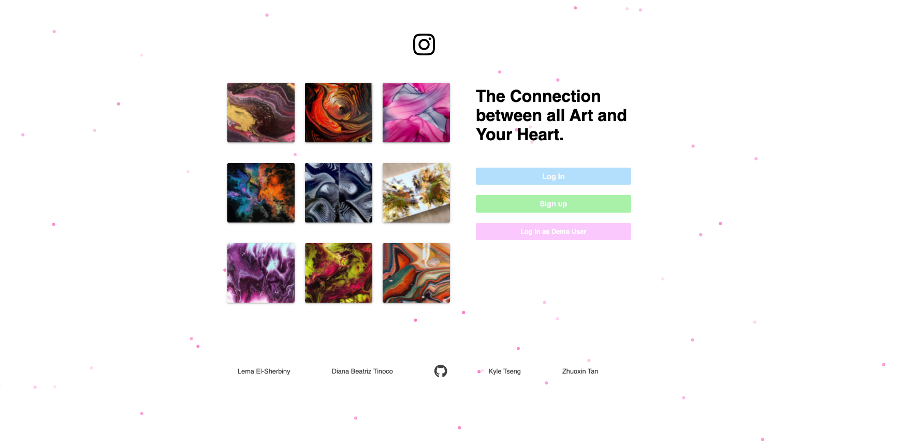

# artygram

Artygram is an Instrgram clone targeted towards artist. On Artygram you can browse artist profile pages and vew thier work 

## Welcome View 

 

## Home View

## Technical Details

Artygram's backend is built using Flask and frontend is built using React-Redux 

## Features 

- Sign up, login and demoUser 
- Post Image/Edit Image/Delete Image 
- Like/Unlike Photos
- Follow/Unfollow Photos 
- Photo Feed
